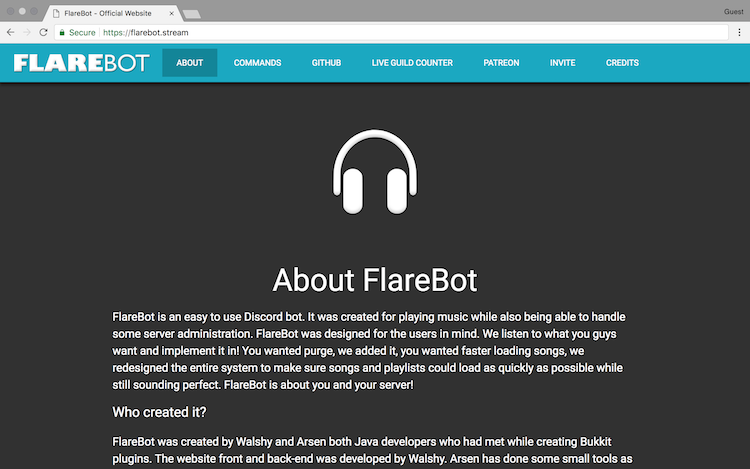
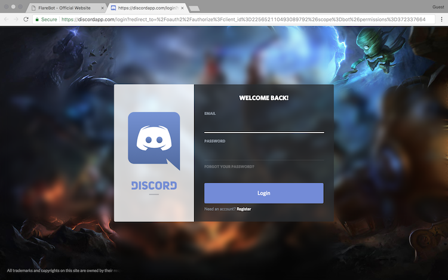
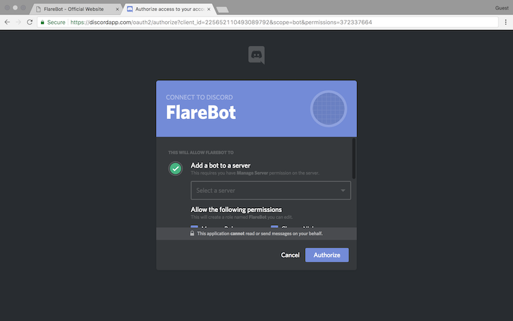
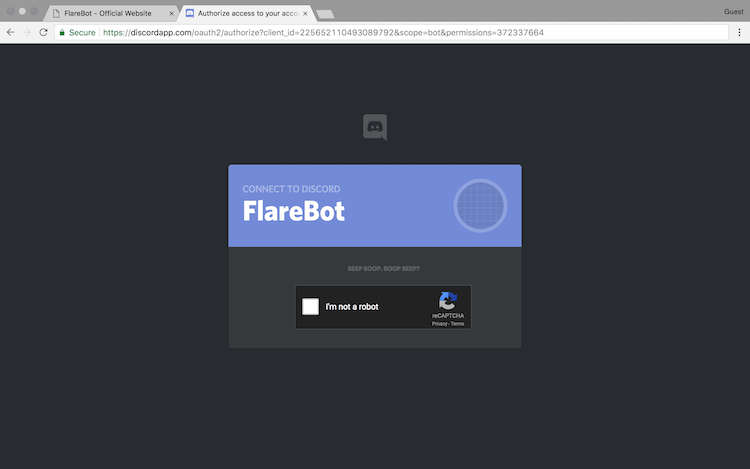
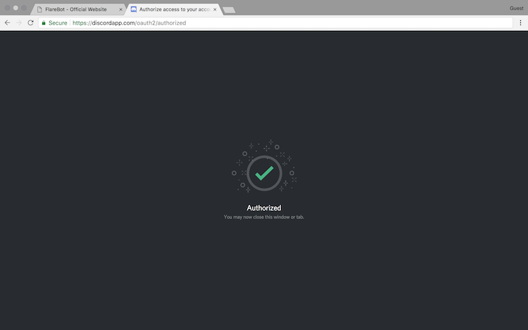
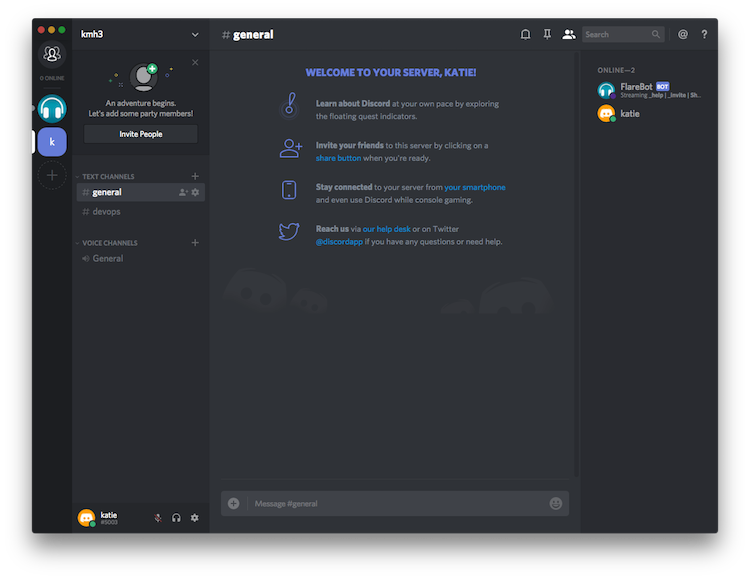
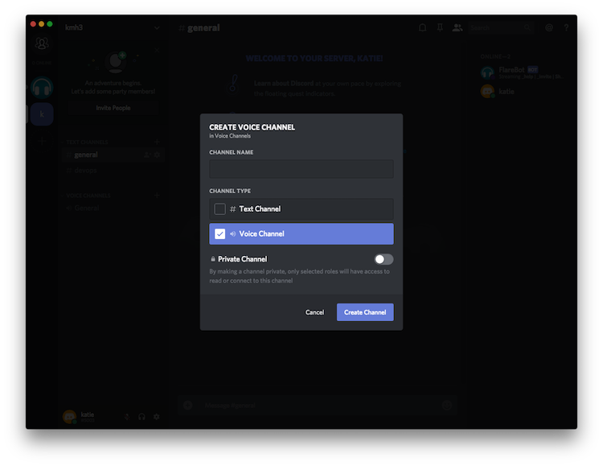
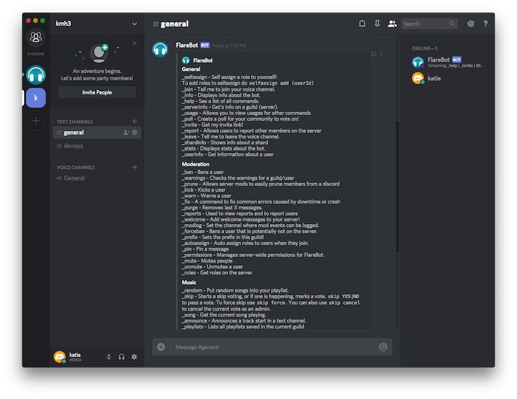
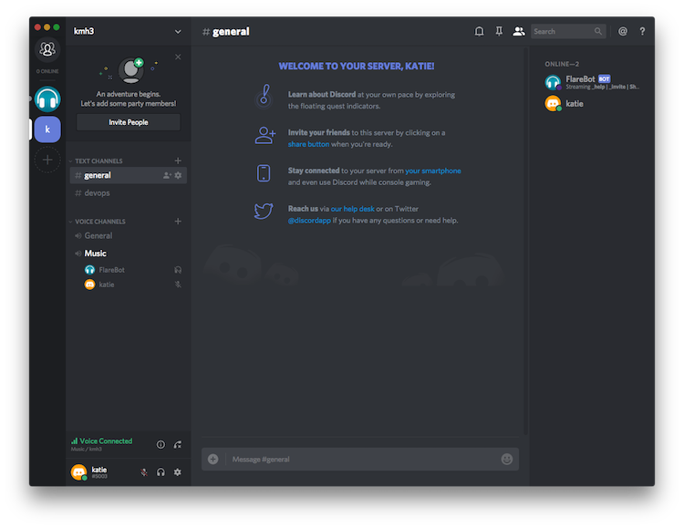
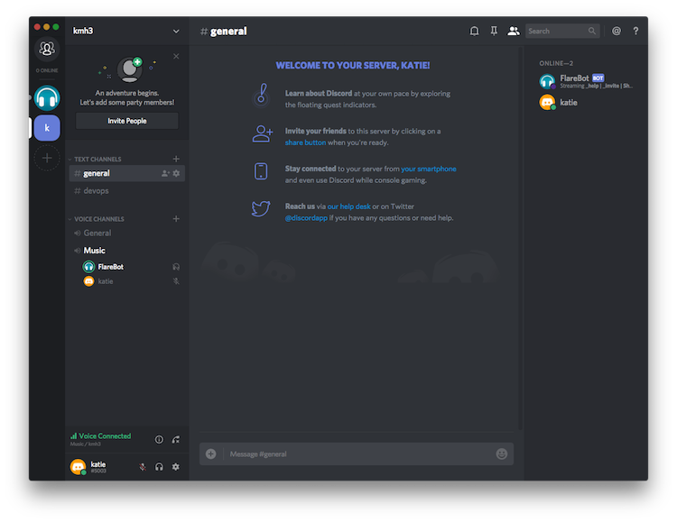

# Flarebot

FlareBot is a Discord bot that plays music and handles basic server admin tasks. Here's how to get up and running.

## Getting Started

We're assuming that you have a Discord server already; if not, spin one up before proceeding.

Once your server is ready, go the [FlareBot homepage](https://flarebot.stream/). Click **Invite**.

If you aren't already logged in to your Discord account, do so now.

Select the server for which you want FlareBot added.
Set the permissions you want granted to FlareBot.
Click **Authorize**.

Prove that you're not a robot.

If you're successful, you'll see a message saying **Authorized**:

## Using FlareBot

Once authorized, FlareBot is a full "member" of your server.

If you're interested in the music features of FlareBot, you'll need to have at least one Voice Channel. If not, create one by clicking the **plus icon** next to **VOICE CHANNELS** in the left-hand navigation pane.

Set the name and channel type, and click **Create Channel** to proceed.

At this point, you can begin using FlareBot. You can see a list of commands available to you by running **_help**. You can also see the list on the [FlareBot site](https://flarebot.stream/#commands). There are three categories of commands: **General**, **Moderation**, and **Music**.

As an example, let's create a playlist that includes Of Monsters and Men's *Wolves Without Teeth* and Dolly Parton's *Jolene*. We can do so with the following two commands:

* `_play wolves without teeth`
* `_play jolene dolly parton`

Now we can play our songs. We'll click on the voice channel we want to use (in this case, it's **Music**) and send the message **_join**.

FlareBot will join the channel you indicated.

FlareBot will begin playing music (if there are songs in the playlist).

